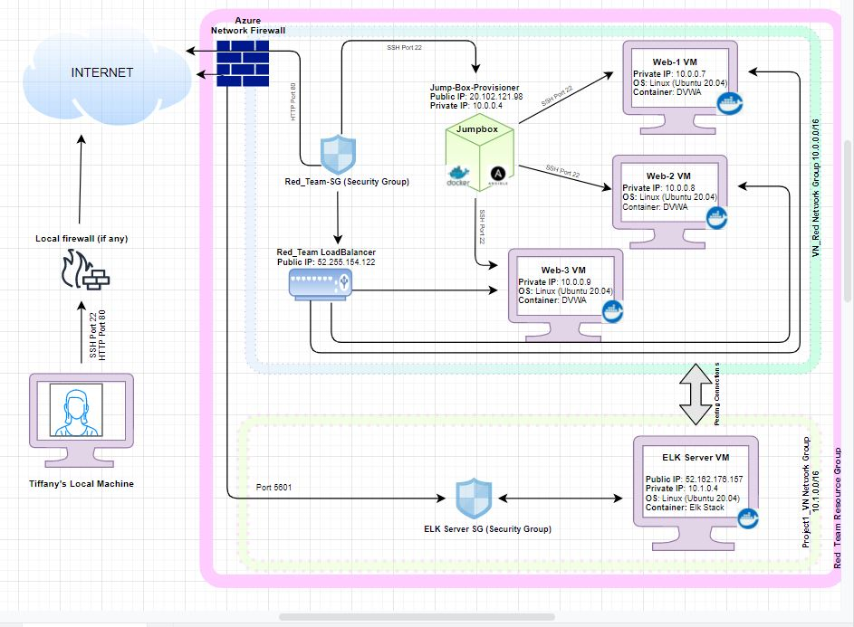
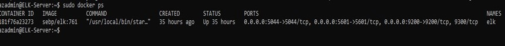

## Automated ELK Stack Deployment

The files in this repository were used to configure the network depicted below.

 
These files have been tested and used to generate a live ELK deployment on Azure. They can be used to either recreate the entire deployment pictured above. Alternatively, select portions of the file may be used to install only certain pieces of it, such as Filebeat.

  - [My Playbook](Ansible/my_playbook.yml)
  - [Install ELK Stack Playbook](Ansible/Install-ELK.yml)
  - [Filebeat Playbook](Ansible/Filebeat-playbook.yml)
  - [Metricbeat Playbook](Ansible/Metricbeat-playbook.yml)

This document contains the following details:
- Description of the Topology
- Access Policies
- ELK Configuration
  - Beats in Use
  - Machines Being Monitored
- How to Use the Ansible Build

### Description of the Topology

The main purpose of this network is to expose a load-balanced and monitored instance of DVWA, the D*mn Vulnerable Web Application.

Load balancing ensures that the application will be highly available, in addition to restricting access to the network.
Load balancer are designed to be secure your network by disbursing traffic to different web servers in the resource pool to ensure that no single server becomes overworked and subsequently unreliable. Jump boxes are usually a single audit point for traffic where prospective administrators must log into in order to gain access to the DMZ assets and all access can be logged for a later audit. It is usually security hardened and treated as a single entryway and a "pivot server" to access other servers within your network.

Integrating an ELK server allows users to easily monitor the vulnerable VMs for changes to the log files and system metrics.

The configuration details of each machine may be found below.

| Name                 | Function  | IP Address - Public | IP Address - Private | Operating System   |
|----------------------|-----------|---------------------|----------------------|--------------------|
| Jump-Box Provisioner | Gateway   | 20.102.121.98       | 10.0.0.4             | Linux Ubuntu 20.04 |
| Web-1                | VM Server | None                | 10.0.0.7             | Linux Ubuntu 20.04 |
| Web-2                | VM Server | None                | 10.0.0.8             | Linux Ubuntu 20.04 |
| Web-3                | VM Server | None                | 10.0.0.9             | Linux Ubuntu 20.04 |
| ELK Server           | ELK Stack | 52.162.176.157      | 10.1.0.4             | Linux Ubuntu 20.04 |

### Access Policies

The machines on the internal network are not exposed to the public Internet. 

Only the Jump-Box-Provisioner machine can accept connections from the Internet. Access to this machine is only allowed from the following IP addresses:
- Tiffany's Home Computer Public IP Address

Machines within the network can only be accessed by the Jump-Box-Provisioner.
- Tiffany's Home Computer Public IP Address

A summary of the access policies in place can be found in the table below.

| Name                 | Publicly Accessible | Allowed IP Address                     |
|----------------------|---------------------|----------------------------------------|
| Jump-Box Provisioner | Yes                 | Tiff's Home Computer Public IP Address |
| Web-1                | No                  | 10.0.0.4                               |
| Web-2                | No                  | 10.0.0.4                               |
| Web-3                | No                  | 10.0.0.4                               |
| ELK Server           | Yes                 | Tiff's Home Computer Public IP Address |

### Elk Configuration

Ansible was used to automate configuration of the ELK machine. No configuration was performed manually, which is advantageous because it allows streamlined, consistent, and identical  configuration of a wide range of systems and devices such as databases, storage devices, networks, firewalls, etc., all at one time.

The playbook implements the following tasks:
- Install docker.io
- Install python3-pip
- Install docker module
- Increase and use more virtual memory
- Download and launch a docker elk container

The following screenshot displays the result of running `docker ps` after successfully configuring the ELK instance.

### Target Machines & Beats
This ELK server is configured to monitor the following machines:
| Name  | IP Address |
|-------|------------|
| Web-1 | 10.0.0.7   |
| Web-2 | 10.0.0.8   |
| Web-3 | 10.0.0.9   |

We have installed the following Beats on these machines:
- Filebeat
- Metricbeat

These Beats allow us to collect the following information from each machine:
- Filebeat: It collects data about the file system such as LOG DATA and forwards the system logs to an easy to read format.
- Metricbeat: It collects machine METRICS such as CPU usage and uptime. It collects metrics from your system and services and makes it easy to monitor specific information about the machines in the network.

### Using the Playbook
In order to use the playbook, you will need to have an Ansible control node already configured. Assuming you have such a control node provisioned: 

SSH into the control node and follow the steps below:
- Copy the ansible.cfg file to etc/ansible directory inside the ansible container.
- Update the hosts file to include the webservers groups with Web-1, Web-2, and Web-3 IP addresses to Ansible's inventory and also include python3 interpreter.

- Run the playbook, and navigate to http://52.162.176.157:5601/app/kibana to check that the installation worked as expected.

_TODO: Answer the following questions to fill in the blanks:_
- _Which file is the playbook? Where do you copy it?_
- _Which file do you update to make Ansible run the playbook on a specific machine? How do I specify which machine to install the ELK server on versus which to install Filebeat on?_
- _Which URL do you navigate to in order to check that the ELK server is running?

_As a **Bonus**, provide the specific commands the user will need to run to download the playbook, update the files, etc._
